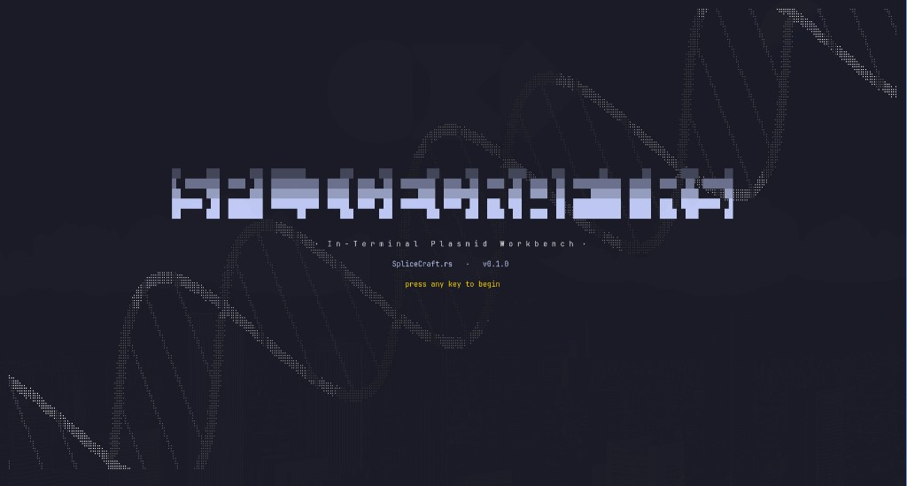
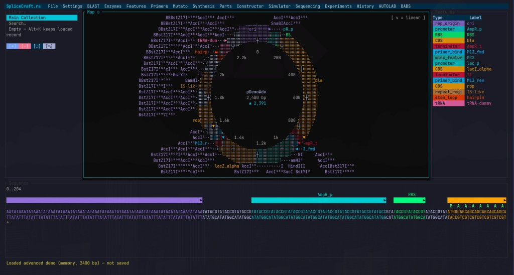

# SpliceCraft.rs



Terminal-based plasmid map viewer, sequence editor, and cloning / mutagenesis
workbench.



## Install

From a checkout:

```bash
cargo install --path crates/splicecraft
splicecraft
```

Or run without installing:

```bash
cargo run -p splicecraft        # splash → workbench (F10 menus, ? help, Ctrl+K, q / Esc quit)
splicecraft --no-splash         # skip the DNA entry screen
```

Requires Rust 1.88+ (Ratatui 0.30). crates.io publication is later; the
install path above is the supported one.

```bash
cargo test --workspace
cargo fmt --all -- --check
cargo clippy --workspace --all-targets -- -D warnings
```

```bash
cargo run -p splicecraft-cli -- version
cargo run -p splicecraft -- --headless --agent-port 6701   # localhost API only
cargo run -p splicecraft-cli -- call list-library
```

## Crate map

| Crate | Role |
|---|---|
| `splicecraft-core` | Records, wrap-aware features, circular math |
| `splicecraft-util` | Helpers, time source, sanitizers |
| `splicecraft-bio` | IUPAC, reverse-complement, restriction scan, translate |
| `splicecraft-persist` | Atomic JSON, backups, write chokepoint |
| `splicecraft-io` | GenBank / FASTA / GFF / NCBI / sequencing / `.dna` |
| `splicecraft-codon` | Codon tables, optimize, forbidden-site scrub |
| `splicecraft-primer` | Primer design (MIT path; no GPL `primer3` crate) |
| `splicecraft-clone` | Traditional / Gibson / Golden Braid / MoClo |
| `splicecraft-gels` | Agarose mobility + gel render data |
| `splicecraft-tui` | Ratatui workbench |
| `splicecraft-agent` | Localhost JSON API |
| `splicecraft-cli` | `splicecraft-cli` sidecar |
| `splicecraft` | `splicecraft` binary |

## License

MIT. Inspired by SpliceCraft (MIT) by Binomica Labs.
